baileys.service.ts — the core engine. Uses makeWASocket to connect as a linked device, then listens to messages.upsert. Every incoming message passes through 6 gates before anything happens: is it a group message? Is it from a consented group? Is it a duplicate? Has the rate limit been hit? Only messages that pass all 6 reach the AI.
group-consent.service.ts — the privacy enforcer. Manages which groups each user has approved. Has a hard DB-level limit of 5 groups. The Baileys service queries this table before every message — if the group JID isn't on the list, the message is dropped at the library level, not in your business logic.
antiban.guard.ts — exponential back-off for reconnections. After 1 reconnect it waits 5s, after 3 it waits 40s, after 6 it waits 5 minutes. Prevents reconnect loops that WhatsApp's ML flags as bot-like.
extraction.service.ts — two-tier AI pipeline. Tier 1 is a free keyword/pattern check that drops obvious non-tasks (85% of messages). Only the remaining ~15% go to Claude, keeping API costs sustainable.
whatsapp-routes.ts — four Next.js API routes: /connect to start a session, /qr-stream (SSE) to deliver the QR to the frontend, /groups to manage consent, and /task-stream (SSE) so new tasks appear on the dashboard live without polling.
schema.sql — run this in Supabase. Includes Row-Level Security so users can never see each other's data, a DB trigger enforcing the 5-group limit, and an auto-purge function that wipes raw message text after 30 days.

The three most important anti-ban decisions baked in
First, the socket is configured with markOnlineOnConnect: false — the session never announces itself as online, so it looks like an idle linked device (like a laptop with WhatsApp Web open but minimised).
Second, it only connects during active business hours (8 AM–9 PM IST) and gracefully disconnects outside those hours, scheduling a reconnect for the next morning. An account that's online 24/7 is a bot pattern.
Third, there is no sock.sendMessage() call anywhere in the codebase. The service is structurally read-only — even if a developer wanted to send a message from this service, they'd have to add the call themselves.